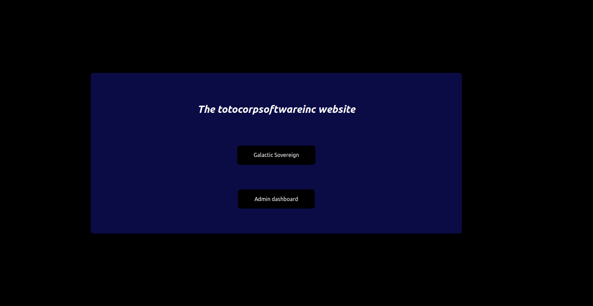

# website-lobby

This repository defines the frontend for the homepage of the [gasteropo.de](https://gasteropo.de) website.

It gives options to navigate the various subdomains of the website.

# Badges

[](https://github.com/Knoblauchpilze/website-lobby/actions/workflows/build-and-push.yml)

# What is this?

This project powers the home page of the [gasteropo.de](https://gasteropo.de) website. The goal is to provide a lobby to redirect to sub-domains containing the various services proposed on the website.

The current state of the project looks like the below picture:



Each option redirects to a specific service available on the website.

Using this approach we can easily add new sub-domains or services, or even redirect to external resources.

# Installation

## Prerequisites

This project uses the following technologies:
* [node](https://nodejs.org/en): you can install it by following the instructions on the [download page](https://nodejs.org/en/download).
* [docker](https://www.docker.com/): this is needed to package the service to a container, you can install it by following [the documentation](https://docs.docker.com/engine/install/).

Note that `docker` is only used in the CI but is not strictly required to develop locally.

Additionally, you need to clone the repo:

```bash
git clone git@github.com:Knoblauchpilze/website-lobby.git
```

## Web frameworks

The project is built using [svelte](https://svelte.dev/) and [tailwindcss](https://tailwindcss.com/).

## Setup the project

Once you have installed the required software you can just install all the required dependencies through:

```bash
make install
```

Alternatively you can use `npm` directly (this is what is done by the `Make` target):

```bash
npm install
```

# Deployment

The CI of this project automatically deploy the docker container produced by the build step to an EC2 instance: this is done by updating the version of the service in the [ec2-deployment](https://github.com/Knoblauchpilze/ec2-deployment) project. This only happens for the `master` branch and triggers the update of the image used by the website.

# Working on the project

If you want to extend or change how the lobby looks like you can use the dedicated `Make` target:

```bash
make dev
```
